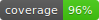

# OpenAPI document generator

A Symfony worker that generates OpenAPI documents based on the 3.0 OpenAPI specification.

This worker is part of a school project that aim to simplify OpenAPI document generation with a web form.

&#35;Symfony6 #MySQL #Docker #Terraform #AWS #TDD #BuilderPattern

## Getting started

Requirements :
- Terraform and Docker CLI
- an AWS account

1. Fill Terraform variables
```bash
cd infrastructure/dev && touch terraform.tfvars
```
2. Deploy the worker and it's infrastructure
```bash
make deploy-dev
```
3. Send a message in the queue to generate an OpenAPI document in S3 from the data fixtures loaded in database
```json
{"documentId": "my-document-uuid"}
```
